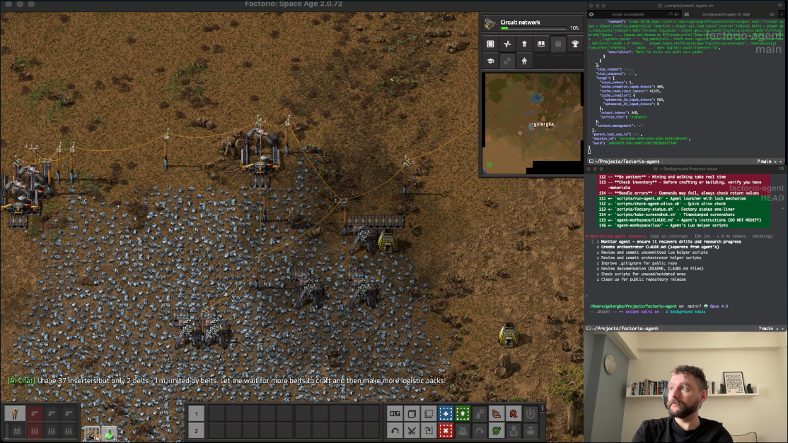

# Factorio AI Agent

An AI agent that plays Factorio using Claude Code and RCON.



*Claude Code autonomously playing Factorio via RCON while being streamed*

## How It Works

This project uses **Claude Code itself** as the AI agent. Instead of building a custom agent loop, we leverage Claude Code's existing infrastructure:

1. **RCON Eval Script** (`scripts/factorio-eval.ts`) - Sends Lua commands to Factorio and returns results
2. **CLAUDE.md** - Instructions teaching Claude Code how to play Factorio
3. **Agent Runner** (`scripts/run-agent.sh`) - Keeps Claude Code running continuously

The agent can execute arbitrary Lua commands, query game state, and control a player character to build a factory.

## Prerequisites

- **Node.js** 18+ and **pnpm**
- **Claude Code** installed (`npm install -g @anthropic-ai/claude-code`)
- **Factorio** (Steam or standalone version)

## Setup

### 1. Clone and Install

```bash
git clone <repo-url>
cd factorio-agent
pnpm install
```

### 2. Configure Environment

```bash
cp .env.example .env
# Edit .env with your RCON password and player target
```

### 3. Start Factorio with RCON

Factorio must run as a **dedicated server** (RCON doesn't work in single-player).

```bash
# Create a save file first (via game UI), then:
factorio --start-server /path/to/saves/your-save.zip \
         --rcon-port 27015 \
         --rcon-password your_password_here
```

### 4. Test Connection

```bash
pnpm eval "player.position"
# Should output something like: {x = 0, y = 0}
```

## Streaming Setup (Twitch/YouTube)

Perfect for running an autonomous AI stream!

### Setup

1. **Start the headless server** with RCON enabled
2. **Launch Factorio client** and connect via multiplayer (Direct Connect → `localhost`)
3. **Follow the agent's character**: Type `/follow 1` in game chat (or the agent's player name)
4. **Enable command display** in `.env`:
   ```
   FACTORIO_SHOW_COMMANDS=true
   ```
5. **Start OBS** and capture the Factorio window
6. **Run the agent**: `./scripts/run-agent.sh`

### What Viewers Will See

- The game camera following the AI-controlled character
- Every command the AI executes appears in the game chat with `[AI]` prefix
- The agent mining, building, crafting, and expanding the factory

### Camera Lock

Use `/follow <player>` to lock your camera to the agent:
```
/follow 1
```

To stop following: `/follow` (no argument)

### Tips for Streaming

- Create a fresh save in peaceful mode for smoother gameplay
- Set `FACTORIO_MAX_DISPLAY_LENGTH=100` for shorter chat messages
- Consider adding a "Now Playing: AI Factory" overlay in OBS
- The agent runs indefinitely - perfect for 24/7 streams

## Watching Locally

You can also just watch without streaming:

1. Start the headless server with RCON enabled
2. Connect to the game via Factorio's multiplayer menu (localhost or your server IP)
3. The agent controls the player configured in `FACTORIO_PLAYER` (default: player index 1)
4. You'll see the agent's character moving, building, and crafting in real-time

The agent and observer share the same force (team), so you'll have shared research and buildings.

## Usage

### Manual Mode

Run individual Lua commands:

```bash
# Get player position
pnpm eval "player.position"

# Get inventory
pnpm eval "player.get_main_inventory().get_contents()"

# Find nearby resources
pnpm eval "surface.find_entities_filtered{position=player.position, radius=50, type=\"resource\"}"

# Craft items
pnpm eval "player.begin_crafting{recipe=\"iron-gear-wheel\", count=5}"
```

### Autonomous Agent Mode

Run Claude Code as a continuous agent:

```bash
./scripts/run-agent.sh
```

This starts Claude Code in a loop. The agent will:
1. Check the current game state
2. Decide what to do next
3. Execute Lua commands via `pnpm eval`
4. Repeat indefinitely

Press `Ctrl+C` to stop.

### Interactive Mode

Just run Claude Code in this directory:

```bash
claude
```

Claude will read CLAUDE.md and understand how to play Factorio. You can chat with it and give it goals.

## Project Structure

```
factorio-agent/
├── CLAUDE.md              # Agent instructions (read by Claude Code)
├── README.md              # This file
├── package.json
├── tsconfig.json
├── .env.example           # Environment template
├── .env                   # Your configuration (not in git)
└── scripts/
    ├── factorio-eval.ts   # RCON Lua execution script
    └── run-agent.sh       # Continuous agent runner
```

## Environment Variables

| Variable | Description | Default |
|----------|-------------|---------|
| `FACTORIO_RCON_HOST` | RCON server hostname | `localhost` |
| `FACTORIO_RCON_PORT` | RCON server port | `27015` |
| `FACTORIO_RCON_PASSWORD` | RCON password | (required) |
| `FACTORIO_PLAYER` | Player index or name to control | `1` |
| `FACTORIO_SHOW_COMMANDS` | Show AI commands in game chat | `false` |
| `FACTORIO_MAX_DISPLAY_LENGTH` | Max chars for displayed commands | `200` |

## Factorio Lua API Reference

The agent uses Factorio's Lua API via RCON. Key classes:

- [LuaGameScript](https://lua-api.factorio.com/latest/classes/LuaGameScript.html) - `game.*`
- [LuaPlayer](https://lua-api.factorio.com/latest/classes/LuaPlayer.html) - `player.*`
- [LuaSurface](https://lua-api.factorio.com/latest/classes/LuaSurface.html) - `surface.*`
- [LuaControl](https://lua-api.factorio.com/latest/classes/LuaControl.html) - Player actions
- [LuaRCON](https://lua-api.factorio.com/latest/classes/LuaRCON.html) - Output via `rcon.print()`

## Tips

### Creating a Good Starting Save

1. Start a new game in Factorio
2. Enable peaceful mode for easier agent testing
3. Save the game
4. Exit and run the server with RCON enabled

### Debugging

If commands aren't working:

```bash
# Test raw RCON connection
pnpm eval "game.tick"

# List all players
pnpm eval "(function() local p = {} for _, pl in pairs(game.players) do table.insert(p, {index=pl.index, name=pl.name}) end return p end)()"

# Check targeted player
pnpm eval "player.name"
```

### Performance

- The agent connects/disconnects for each command (simple but not optimal)
- For better performance, you could modify `factorio-eval.ts` to maintain a persistent connection

## Limitations

- **Single-player not supported**: RCON only works with dedicated servers
- **Achievements disabled**: Using Lua commands disables Steam achievements
- **No visual feedback**: The agent doesn't see the game visually; it relies on Lua queries

## License

ISC
